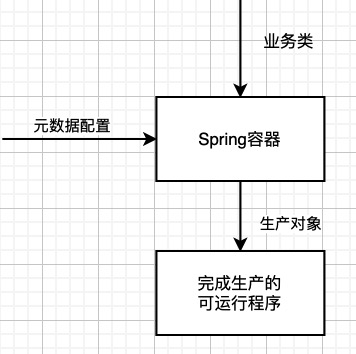

# Core Technologies

参考[Spring Core文档](https://docs.spring.io/spring-framework/docs/current/reference/html/core.html)
> 版本：5.3.5

该文档主要介绍了**Spring框架的控制反转（IoC）容器**和**Spring的面向方面的编程（AOP）技术**。

## 1. IOC容器

### 1.1. Spring IoC容器和Bean简介

本章将介绍Spring的控制反转（IoC）实现。IoC也称为依赖注入（DI）。他是一个过程，首先只能通过构造函数参数、工厂方法的参数或在构造或创建对象实例后在对象实例上设置属性的这些方式来**定义依赖项**，然后在容器创建bean时**注入依赖项**。

IoC容器的基础是这两个包：`org.springframework.beans`和`org.springframework.context`。其中`BeanFactory`接口定义了管理对象的机制，`ApplicationContext`是其子接口，附加了企业级功能，本章节也是重点围绕`ApplicationContext`展开的。

在Spring中，Bean是由IoC容器实例化、组装和管理的对象。容器使用的配置元数据反映了Bean之间的依赖关系。

### 1.2. 容器简介

`org.springframework.context.ApplicationContext`接口代表了Spring IoC容器，并且其负责Bean的实例化、组装及管理。容器通过读取配置元数据获取Bean信息及依赖关系。 比如`ClassPathXmlApplicationContext`容器实现可用于读取XML配置。



#### 1.2.1 配置元数据方式
配置元数据，是开发人员指定用于Spring容器实例化、组装和管理对象的配置。
元数据配置方式有XML、基于注解配置、基于Java代码配置。
XML方式通过`<bean>`标签及属性定义配置；
基于注解配置，相关注解如`@Component`、`@Autowire`等；
基于Java代码配置，其功能需要配合`@Configuration`，`@Bean`，`@Import`，和`@DependsOn`注解使用；

#### 1.2.2 实例化容器
在容器管理Bean之前，首先要创建容器。
```
ApplicationContext context = new ClassPathXmlApplicationContext("1_2_2_实例化容器.xml");
```
> 指定配置文件不建议使用"../"相对路径

#### 1.2.3. 使用容器
通过使用`ApplicationContext`的方法`T getBean(String name, Class<T> requiredType)`，可以检索bean的实例。
> 代码见 io.github.wesleyone.spring.core.c1.c2.ContainerTest

### 1.3. Bean简介
Spring IoC容器管理一个或多个bean。这些Bean是根据开发人员提供的配置元数据创建生成。
在容器内部，通过`BeanDefinition`对象保存bean定义，该对象包含以下属性：
- 类全限定名
- Bean在容器中的行为（作用域、生命周期回调等）
- 依赖项
- 其他自定义配置

配置元数据会转换成`BeanDefinition`中的属性。下表描述了部分属性：

| 属性 | 介绍|
| --- | ---|
|Class| 需要管理的类|
|Name | Bean名称|
|Scope| Bean生命周期|
|Constructor arguments| 配置的构造器入参，用于DI|
|Properties| 配置的属性，用于DI|
|Autowiring mode| 自动注入模式|
|Lazy initialization mode| 懒加载模式|
|Initialization method| 初始化回调方法|
|Destruction method| 销毁回调方法|

> 另外允许手动注册方式添加Bean定义。但是，手动注册需要尽早完成，以便容器在自动装配时可以正确的获取到它。
> 
> 虽然允许覆盖已有的Bean定义或单例实例，但是在运行时注册新的Bean是官方不支持的(程序正常，不建议)，防止并发访问异常。
> 
> 参考用例 io.github.wesleyone.spring.core.c1.c3.BeanTest

#### 1.3.1. Bean命名
一个Bean可以对应多个名称，一个名称只能对应唯一Bean。
在Bean定义命名外，可以为Bean Name管理更多的别称（alias）。

#### 1.3.2. 实例化Bean
Bean定义是创建一个或多个对象的诀窍。容器通过Bean命名查找到Bean定义，然后使用该Bean定义封装的配置元数据创建（或获取）真实的对象。
- 构造函数实例化
- 静态工厂方法实例化
- 使用实例对象的工厂方法

> 参考用例 io.github.wesleyone.spring.core.c1.c3.InstantiationBeanTest.instantiationBeanTest
> 
>  本章配置文件中的`factory-bean`和`FactoryBean`没有任何关系。`factory-bean`配置是指定静态工厂方法所属的实例对象。而`FactoryBean`是用于创建对象。

**获取运行时的Bean类型**
由于使用静态工厂方法实例化、实例对象的工厂方法实例化、`FactoryBean.getObject()`、AOP代理包装Bean实例，导致Bean的实际类型暴露程度有限。
推荐使用`BeanFactory.getType`获取运行时的Bean类型。

> 参考用例 io.github.wesleyone.spring.core.c1.c3.InstantiationBeanTest.getTypeTest

### 1.4. 依赖关系（Dependencies）
Bean定义内的依赖项用于表名当前Bean的依赖关系

#### 1.4.1. 依赖注入（DI）
依赖注入是一个过程。该过程中，对象只能通过构造函数参数、工厂方法的参数或在构造或创建对象实例后在对象实例上设置的属性来定义其依赖关系，然后在创建Bean时注入依赖项。这个过程本质上是bean本身的逆转控制过程，通过类的构造函数和服务定位模式（Service Locator pattern）来控制其依赖项的实例化控制或者定位。

DI存在两个主要方式：**基于构造函数的DI**,**基于Setter的DI**。

##### 基于构造函数的DI
基于构造函数的DI，通过容器调用具有多个参数的构造函数来实现的，其中每个参数都是依赖项。调用带有参数的`static`工厂方法来构造Bean时，他的参数也是依赖项。

构造函数参数解析方式包括：
1. 构造函数参数类型匹配
2. 构造函数参数索引(索引从0开始)
3. 构造函数参数名称

后两种方式，在存在相同类型参数时，可以消除歧义。
> 参考用例：io.github.wesleyone.spring.core.c1.c4.DITest.DIConstructorTest

##### 基于Setter的DI
通过使用无参数构造函数或无参数`static`工厂方法实例化bean之后，容器通过调用bean上的setter方法来实现基于setter的DI。

> 基于构造函数的DI 和 基于Setter的DI 可以混合使用。建议将构造函数注入用于强制参数依赖项注入，setter注入用于可选依赖项注入。
> 
> 参考用例：io.github.wesleyone.spring.core.c1.c4.DITest.DISetterTest

##### 依赖关系解析过程
容器执行bean依赖项解析过程如下：
- `ApplicationContext`通过配置元数据来创建和初始化所有bean。配置元数据可以通过XML，Java代码或注解来指定。
- 对于每个bean，其依赖项都以属性、构造函数参数或`static-factory`方法的参数的形式表示。在创建Bean时，会将这些依赖项提供给Bean。
- 每个属性或构造函数参数都是要设置具体的值，或者是对容器中另一个bean的引用。
- 每个值的属性或构造函数参数都将从其指定的格式转换为该属性或构造函数参数的实际类型。默认情况下，Spring会以`String`类型，自动把值转换成所需的内置类型，比如int， long，String，boolean等等。

在创建容器时，Spring会验证每个bean的配置。但是只有创建Bean时，才会设置依赖项。懒加载或作用域不同，可能会造成较迟创建Bean。

> 循环依赖：
> 
> 如果使用构造函数注入，则可能无法解决的循环依赖。比如说A类构造函数参数为B类，B类构造函数参数为A类，则相互注入，容器在运行时检测到后会抛出`BeanCurrentlyInCreationException`异常。
> 
> 使用setter注入有效解决循环依赖
> 
> 参考用例：io.github.wesleyone.spring.core.c1.c4.DITest.circularDependenciesTest
> 
> 模仿IoC源码处理依赖循环代码：io.github.wesleyone.spring.core.c1.c4.DITest.normalCircularDependencies_like_spring

Spring默认**非懒加载**，可以提前发现依赖项问题引起的异常。
如果不存在依赖循环关系，容器在对BeanA调用setter方法之前完全实例化BeanB。

#### 1.4.2. 依赖关系配置细节
- 内部类的引用。不能指定id、name、scope。内部类始终与外部类一起创建。
- 集合、集合合并
- 复合属性名

> 参考用例：io.github.wesleyone.spring.core.c1.c4.DIConfigurationTest

#### 1.4.3. `depends-on`
当bean之间没有直接依赖关系，但是初始化时希望有序，则可以使用`depends-on`。
`depends-on`强制使用该配置的Bean在初始化之前，先完成该配置中的所有Bean的初始化。当销毁时，则顺序相反。

> 参考用例：io.github.wesleyone.spring.core.c1.c4.DIDependsOnTest

#### 1.4.4. 懒加载
单例默认**非懒加载**。可以立即发现配置或环境的错误。
开启懒加载的Bean在初次使用时创建Bean实例。
当懒加载的Bean被其他非懒加载的Bean依赖时，会提前初始化。

> 参考用例：io.github.wesleyone.spring.core.c1.c4.DILazyInitTest

#### 1.4.5. *自动装配（Autowiring）
自动装配，可以减少指定属性和构造函数参数的编码量，可以自动更新依赖项的实现类。

自动装配有四种模式：

| 模式 | 介绍 |
| --- | --- |
| `no` | （默认）无自动装配。Bean引用必须由`ref`元素显式定义。 |
| `byName` | 按照属性名称自动装配。容器会查找属性名称同名的Bean来装配。 |
| `byType` | 按照属性类型自动装配。容器中有且只有一个该类型的Bean时则用来装配，多个则抛异常，没有则不设置该属性。|
| `constructor` | 按照构造函数参数的类型自动装配。容器中有且只有一个该类型的Bean时则用来装配，否则抛异常 |

##### 自动装配的局限性和缺点
如果项目中都使用自动装配时效果最佳，如果只是部分使用，可能会产生问题。
局限性和缺点如下：
- 显式依赖项`property`和`constructor-arg`设置始终会覆盖自动装配。不能自动装配简单的属性，例如基础类型、`String`、`Class`（以及这些类型的数组）。
- 自动装配不如显式接线精确。
- 装配信息可能不适用于通过Spring容器生成文档的工具。
- 自动装配的属性类型或构造函数参数类型可能与容器中多个Bean定义匹配。如果没有唯一的bean定义，则会抛异常。但对于数组、集合、`Map`实例，这不一定会报错。

最后一点的解决方法如下：
- 关闭自动装配，使用显式声明依赖
- 排除属性Bean被自动装配
- 通过设置`<bean>`标签的`primary=true`，将该Bean定义指定为主要候选者
- 基于注解配置，实现更细力度的控制

##### 排除属性Bean被自动装配
容器在自动装配BeanA时，不希望根据类型查找到的BeanB，可以设置BeanB的配置`autowire-candidate=false`。
前提是**基于类型的自动装配**才有效，该配置不会影响基于名称的引用。

> 参考用例：io.github.wesleyone.spring.core.c1.c4.DIAutowiringTest

#### 1.4.6. 方法注入
单例对象依赖非单例对象时，由于单例对象只会创建一次，设置非单例对象属性也只有一次，导致在单例中使用非单例对象时都是相同的对象。
方法注入就是为了解决这个问题。
Spring框架通过CGLIB库动态生成子类，从而实现方法注入。因此该方法编码限制参考CGLIB要求。

> 参考用例：io.github.wesleyone.spring.core.c1.c4.DIMethodInjectionTest

### 1.5. Bean Scopes 作用域
有六种作用域：

| Scope | 描述 |
| --- | --- |
| singleton | （默认）单例。单个Bean定义限定用于单个实例 |
| prototype | 原型。单个Bean定义可用于多个实例|
| request | 单个Bean定义限定用于单个HTTP请求的生命周期。只能在Web容器中使用。|
| session | 单个Bean定义限定用于单个HTTP会话的生命周期。只能在Web容器中使用。|
| application | 单个Bean定义限定用于单个`ServletContext`的生命周期。只能在Web容器中使用。|
| websocket |单个Bean定义限定用于单个`WebSocket`的生命周期。只能在Web容器中使用。 |

> Spring 3.0开始，线程作用域可用，需要手动注册。参考`SimpleThreadScope`。

#### 1.5.1. Singleton Scope 单例范围
请求相同ID或命名的Bean实例时，容器返回相同实例对象。
容器会在第一次请求时，将该单个实例存储在缓存中，并且对该命名bean的所有后续请求和引用都返回该缓存对象。

#### 1.5.2. Prototype Scope 单例范围
请求相同ID或命名的Bean实例时，容器每次都会创建新对象返回。
Spring不管理原型Bean的完整生命周期。初始化回调方法会执行，但是销毁回调不会执行。

#### 1.5.3 单例Bean依赖原型Bean
单例对象依赖非单例对象时，由于单例对象只会创建一次，设置非单例对象属性也只有一次，导致在单例中使用非单例对象时都是相同的对象。
解决方法为[方法注入](#1.4.6._方法注入)

#### 1.5.4. request、session、application、websocket scope
只能在web容器下使用，比如`XmlWebApplicationContext`。

#### 1.5.5. 自定义作用域

1. 创建自定义作用域实现。实现`org.springframework.beans.factory.config.Scope`接口。
2. 注册自定义作用域。`ApplicationContext.registerScope(..)`

```
// 以官方提供的`SimpleThreadScope`为例
Scope threadScope = new SimpleThreadScope();
beanFactory.registerScope("thread", threadScope);

// 然后指定bean使用自定义的作用域
<bean id="..." class="..." scope="thread">
```

### 1.6. 自定义Bean性质

自定义Bean性质（the Nature of a Bean）常用接口如下：

- 生命周期回调
- `ApplicationContextAware` and `BeanNameAware`
- 其他`Aware`接口

#### 1.6.1. *生命周期回调

##### 初始化回调

- 实现接口`InitializingBean`方法`afterPropertiesSet()`
- 使用JSR-250规范的`@PostConstruct`注解方法（官方推荐，减少与Spring强耦合）
- xml配置`init-method`属性指定方法名
- `@Bean`的`initMethod`配置方法名

##### 销毁回调

- 实现接口`DisposableBean`方法`destroy()`
- 使用JSR-250规范的`@PreDestroy`注解方法（官方推荐，减少与Spring强耦合）
- xml配置`destroy-method`属性指定方法名
- `@Bean`的`destroyMethod`配置方法名

##### 默认初始化和销毁方法
通过设置`<beans default-init-method="init">`，则其内部的所有bean标签默认初始化调用`init`方法。


##### *生命周期机制混合使用

同个Bean同时使用多种方式的执行顺序：

初始化：
1. `@PostConstruct`方法注解
2. `InitializingBean#afterPropertiesSet()`
3. xml配置`init-method`属性或者`@Bean`配置`init`属性（包括默认配置）

销毁：
1. `@PreDestroy`方法注解
2. `DisposableBean#destroy()`
3. xml配置`destroy-method`属性或者`@Bean`配置`destroy`属性（包括默认配置）

##### 启动和关机回调

实现`Lifecycle`接口。当容器收到启动和停止信号时，它将为委派给`LifecycleProcessor`的默认实现`DefaultLifecycleProcessor`，调用所有`Lifecycle`实现的方法。

需要指定顺序可以使用`SmartLifecycle`接口。

##### 在非Web应用程序中正常关闭Spring IoC容器

注册关闭钩子`ConfigurableApplicationContext.registerShutdownHook()`

#### 1.6.2. ApplicationContextAware和BeanNameAware

`ApplicationContextAware`可用于获取容器对象。不推荐使用，不遵循控制反转。可以使用根据类型的自动装配方式获取。
`BeanNameAware`可用于获取定义中的名称。

#### 1.6.3. 其他Aware接口

最重要的`Aware`接口

|名称| 注入依赖 | 
| --- | --- | 
| ApplicationContextAware | 容器事件发布对象 |  |
| ApplicationEventPublisherAware | 容器事件发布对象 |  |
| BeanClassLoaderAware | 类加载器，用于加载Bean类。 | 实例化Bean |
| BeanFactoryAware | BeanFactory |  |
| BeanNameAware | Bean的名称 |  |
| LoadTimeWeaverAware | 编织器，用于加载时处理类定义 | 在Spring框架中使用AspectJ进行加载时编织 |
| MessageSourceAware | 处理消息的策略配置 |  |
| NotificationPublisherAware | Spring JMX通知发布者。 |  |
| ResourceLoaderAware | 配置的加载程序，用于对资源的低级别访问 |  |
| ServletConfigAware | web容器中的ServletConfig |  |
| ServletContextAware | web容器中的ServletContext |  |


### 1.7. Bean定义继承

子bean定义可以从父bean定义中继承配置数据。子定义可以覆盖某些值或根据需要添加其他值。使用继承可以减少编码量，是一种模版形式。
子bean定义的对象实质上是`ChildBeanDefinition`。

子bean定义能继承的内容包括：构造函数参数、属性值和方法，并可以添加新值。对于任何作用域，初始化方法、销毁方法或者静态工厂方法设置都会覆盖父定义配置。
始终从子定义获取的内容包括：依赖项、自动装配模式、依赖项检查、单例以及懒加载。

> 参考用例：io.github.wesleyone.spring.core.c1.c7.BeanDefinitionInheritanceTest

### 1.8. 容器扩展点
通过插入扩展接口实现来扩展IoC容器功能。

#### 1.8.1. 使用BeanBeanPostProcessor自定义Beans
可以在每个Bean初始化前后进行处理。
容器在初始化Bean之前，会先自动检测所有`BeanBeanPostProcessor`实现，以便用于其他Bean的初始化。
可以通过同时实现`Ordered`接口指定多个`BeanBeanPostProcessor`执行顺序。

`BeanPostProcessor`实现的前置方法在每个Bean初始化之前，后置方法在每个Bean初始化之后；

> 编程方式主动注册`BeanPostProcessor`对象。`ConfigurableBeanFactory.addBeanPostProcessor()`。这用于跨层（hierarchy）上下文复制`BeanPostProcessor`对象。
> 这种方式不遵守`Ordered`接口，按照注册顺序执行。这种编程注册总是在自动检测注册前被调用执行。

> SpringAOP动态代理是通过`BeanPostProcessor`实现的，所以`BeanPostProcessor`对象本身或它引用的bean无法被编织;通常会看到这样的日志`Bean someBean is not eligible for getting processed by all BeanPostProcessor interfaces (for example: not eligible for auto-proxying)`

> 例如：自动装配`@Autowired`的功能实现就是由`AutowiredAnnotationBeanPostProcessor`实现的；自动装配带注解的属性、setter方法和任意配置方法。

> 参考用例：io.github.wesleyone.spring.core.c1.c8.BeanPostProcessorTest

#### 1.8.2. 使用BeanFactoryPostProcessor自定义配置元数据

`BeanFactoryPostProcessor`用于对Bean的配置元数据进行操作。
可以通过同时实现`Ordered`接口指定多个`BeanFactoryPostProcessor`执行顺序。

Spring内置了很多`BeanFactoryPostProcessor`实现。比如`PropertyOverrideConfigurer`和 `PropertySourcesPlaceholderConfigurer`。`PropertyOverrideConfigurer`根据beanName.属性名匹配配置值替换bean属性，`PropertySourcesPlaceholderConfigurer`根据占位值替换。

容器会自动检测`BeanFactoryPostProcessor`接口的所有实现bean定义。

#### 1.8.3. 自定义FactoryBean

对于复杂对象的初始化，XML方式配置会冗长，可以通过实现`FactoryBean`接口方式更好地表达。

`FactoryBean`三个方法解释：

- `Object getObject()`:返回此工厂创建的对象实例。
- `boolean isSingleton()`:返回对象是否单例。
- `Class getObjectType()`:返回对象的类型。未知类型返回null。

当需要调用`FactoryBean`自身对象实例时，需要在bean的`id`前面加上`&`符号。


